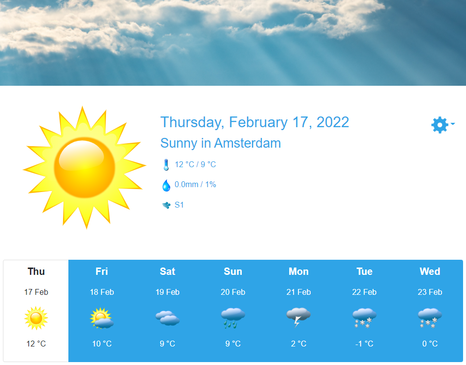

# SpecFlow Weather Forecast Sample

This repository contains a sample app to show some of the different features SpecFlow has to offer.



## Known issues

### CORS error in Firefox

A self-signed certificate is used when running the UI and Web API on your development machine. 
The certificate can be trusted by adding it to the local certificate store. 
Firefox however doesn't use this store by default, so you'll get the following error when the Blazor UI performs a call on the Web API.

```
Cross-Origin Request Blocked: The Same Origin Policy disallows reading the remote resource at https://localhost:7288/api/... (Reason: CORS request did not succeed). Status code: (null).
```

Either use another browser like Edge/Chrome or go to `about:config` in Firefox and set the `security.enterprise_roots.enabled` setting to `true`.
